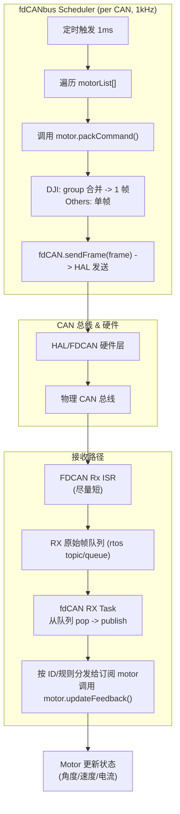

## RC10_R1_FRAME_TEST 说明书

### 简介
    此文档重在记录RC10_LIB的设计思路，若是想快速上手RC10_LIB还请移步用户手册。
    此文档写的还是相对凌乱，大多时候只是用来记录笔者的想法和实现

    一切坐标采用右手系，不符合的就变换为右手系。yaw轴逆时针旋转为正方向(右手定则)
    可以使用arm_math库进行加速的，尽量使用

    其实这份README也开始大量充斥AI写的东西了，不过这个只是为了其他人想拓展RC10_LIB时候看的
    

### RC10_LIB的核心设计原则
1. 严格分层，职责单一
   框架分为硬件驱动层、设备协议层、算法层和应用层。当你添加新功能时，必须明确其归属。

   硬件驱动只负责与物理总线通信。
   设备协议只负责解析和打包特定设备的报文。
   算法是纯粹的数学工具。
   应用只负责下达高层指令。 原则： 禁止跨层调用，保持各层纯粹性。

2. 信任自动化调度，分离计算与打包
   1. 例如: fdCANbus 框架提供一个高频率的中央调度器，它会自动调用所有注册设备的 update() 和 packCommand()。

   update(): 只用于计算。执行如PID等周期性算法，更新内部状态。
   packCommand(): 只用于打包。读取 update() 的计算结果，并将其组装成待发送的CAN报文。
   setTarget...(): 只用于接收指令。这是你的驱动提供给应用层的接口，用于设置高级目标。 原则： 永远不要在 packCommand() 中进行计算，也不要在 update() 中组装报文。相信调度器会按正确的顺序调用它们。

3. 继承统一接口，利用多态实现特异性
   框架通过面向接口编程实现扩展性。所有设备驱动都必须继承自一个共同的基类（如 Motor_Base）。

   统一管理: 调度器只与基类接口交互，它不关心具体是什么设备。
   虚函数实现多态: 使用 virtual 函数（如 get_GearRatio()）来让每个子类提供自己独特的信息或行为。 原则： 你的新设备驱动必须实现基类的所有纯虚函数，并利用虚函数重写（override）来实现其特定协议和功能。

4. 用户使用接口的简化
   将一切的重复性工作都在类的封装中实现，使得用户在开发应用层的时候无需写太多冗杂重复的代码，更高效进行开发。


### 编码方式
    统一使用GB2312
### 命名规范
    在类中的变量统一带_的后缀，形参不带后缀

### 文件架构

1. BSP_Driver
    此用于存放最底层驱动，如fdCAN, UASRT, SPI IIC, TIM RTOS等驱动。
    前缀为==BSP_==
2. Motor
    此用于存放电机驱动.
    前缀为==Motor==
3. APP
    此用于存放控制器、滤波器和一些工具，又亦或是其他复用性强的算法之类的。
    前缀为==APP==
4. Module
    此用于一些复用性强的模块的封装，如激光测距模块、灯带等等
    此前缀为==Module==

##### 目前的设计思路
用统一的FdCanBus 封装负责fdCAN硬件、过滤与RX分发。用Motor基类定义统一接口，而motor基类可以派生两个主要子类：`DJIMotor`和`ExtendedMotor`。这是由于两种电机的报文发送机制不同。使用FreeRTOS(队列\任务)将CAN的收发与电机控制解耦，使用ID映射或查表方式将接收报文分发到正确的电机对象。
1. fdCanBus设计需求
   作为通信通道，而不是直接服务电机（与RC9的不同点）
   1. 单路CAN能够混搭标准帧和拓展帧
   2. 使用FIFO接收CAN帧，ISR简化，只搬运报文，不解析，解析放到RTOS任务中进行
   3. fdCanBus创建对象后自动生成对应任务
   4. 封装了多帧打包，可能有些电机是分多帧发送的，虽然目前还没用的高，不知道以后会不会买这种
   5. 好处：fdCAN 永远是纯通信层，电机逻辑变化不会污染 CAN 驱动。
   6. ==具体实现==
      1. fdCAN提供发送接口给电机类，提供 sendFrame(const CanFrame&) 接口，电机类不会直接调用 HAL。
      2. 在fdCANbus中注册电机,使用Motor_Base指针，这样所有继承Motor_Base的子类都可以注册
      3. fdCAN搬运ISR中的数据包丢到队列，让电机类解析。
      4. 实现CAN发送频率为1kHz，与回传频率一致。这通过内部一个1kHz的调度器任务完成，该任务统一调度所有注册到总线上的对象。
         **调度流程的最终实现**：
         1. **双注册**: 用户需要将**电机对象本身**（如 `m3508_1`）和**电机组对象**（如 `DJI_Group_1`）都注册到 `fdCANbus`。
            *   注册电机本身是为了让调度器能调用其 `update()` 方法，并让接收任务能通过 `matchesFrame()` 找到它并调用 `updateFeedback()`。
            *   注册电机组是为了让调度器能调用其 `packCommand()` 方法来打包发送指令。
         2. **1kHz定时器中断** 触发，释放 `schedulerTask_` 的信号量。
         3. `schedulerTask_` 被唤醒，开始执行两轮遍历：
            *   **第一轮遍历 (Update)**: 遍历 `motorList_`，对每个注册的对象调用 `update()` 方法。此时，`m3508_1->update()` 会被调用，执行PID计算并更新其内部的 `target_current_`。而 `DJI_Group_1->update()` 是空函数，不执行任何操作。
            *   **第二轮遍历 (Pack & Send)**: 再次遍历 `motorList_`，对每个对象调用 `packCommand()`。此时，`m3508_1->packCommand()` 是空函数。而 `DJI_Group_1->packCommand()` 会被调用，它会访问其成员 `m3508_1` 的 `target_current_` 值，并将其打包成CAN帧。
         4. `schedulerTask_` 将所有收集到的帧通过 `sendFrame()` 发送出去。
         这种设计精确地分离了职责：电机对象负责计算，电机组对象负责打包。

      5. 成员变量：FDCAN_HandleTypeDef* hfdcan、bus_id、静态数组管理电机指针
      6. 

        


2. FreeRTOS驱动设计
   1. 封成相应的父类，这部分我暂时没想的太多
   2. 任务系统类，提供统一接口来创建和管理任务，绕过CubeMX的配置生成。
      1. 类似ROS节点中的`spin()`,继承任务系统的子类只需要负责`run`或者`loop`
      2. 主要目的是把RTOS的任务抽象为一个功能单元
   3. 通信抽象类，不一定是要用RTOS实现，一些可以用统一的函数实现参数共享。但大体还有有点类似ROS中的pub/sub或者service；
      1. Publisher/Subscriber：一个任务/类可以向某个话题（队列）发布消息，另一个类订阅后在任务中处理。
      2. Service/Client：用于“请求/响应”模式，比如参数配置、一次性命令。
   4. 好处：以后不只是 CAN，还可以接 UART、SPI、传感器等，都能挂在这个 RTOS 通信框架里。
   5. 具体实现
      1. 任务调度（任务类），封装 FreeRTOS TaskHandle_t，统一管理任务创建、启动和运行逻辑。
      2. 通信机制（消息/话题类）抽象一个类似 ROS topic/service 的父类，后续不一定是完全使用FreeRTOS的queue之类的完成通信。
         1. 模仿 ROS 的 pub/sub：
            1. publish(msg)
            2. subscribe(callback)


   
3. 电机封装的实现
   1. 首先有一个Motor_Base抽象类，作为父类，统一电机所需要的通用接口被后续的子类电机重写。
   2. **核心设计：接收即转换与尺度统一**
      *   **接收即转换**: 在 `DJI_Motor::updateFeedback()` 方法中，从CAN总线收到的原始电机转子数据（编码器值、转速）会**立即**通过调用 `virtual float get_GearRatio() const` 函数获得正确的减速比，并被转换为**输出轴尺度**的数据。
      *   **状态统一**: 转换后，所有存储在 `Motor_Base` 中的成员变量（`rpm_`, `angle_`, `totalAngle_`）都统一为**输出轴的状态**。
      *   **控制闭环统一**: 所有PID控制环路（在 `update()` 方法中）的目标值（`target_rpm_`）和反馈值（`this->rpm_`）都基于输出轴尺度进行计算，确保了控制的正确性。
   3. 在之后
      1. DJI
         1. 有DJI_Motor管理单一电机和DJI_Group合帧。
         2. DJI一条CAN上八个电机分上下片帧，id1~4一片，一个canid,5~8一片，一个canid
         3. 之后具体电机需要继承
      2. 其他电机
         1. 继承Motor_Base完成各自的协议。
   4. 电机发送报文的生成和回收报文的解析在电机类中实现
   5. 具体实现
      1. PID作为电机类中的成员，而非电机类继承PID类。
      2. 提供通用接口(Motor_Base抽象层)：

        setTargetRPM() / setTargetCurrent() / setTargetAngle()/setTargetTotalAngle()

        getRPM() / getPosition() / getCurrent() / getTotalAngle()

        packCommand()（把目标量转成 CAN 报文）

        updateFeedback()（解析电机返回报文）
        在之后由具体电机类完成闭环控制的封装。
      3. 在电机类中把update()[更新电机所要发送参数] ,和packCommand()[打包参数发送]分开
         1. 具体在fdCANbus中的操作
         2. 1kHz定时器中断触发 -> fdcan_global_scheduler_tick_isr() 释放信号量 schedSem_。
         3. schedulerTaskbody 从信号量等待中被唤醒。
         4. schedulerTaskbody 遍历 motorList_，对每个注册的电机调用 m->update()。
         5. 在 update() 内部，电机根据自身状态（如 ANGLE_CONTROL）执行PID计算，并更新其内部的 target_current_。
         6. schedulerTaskbody 再次遍历 motorList_，调用 m->packCommand()。
         7. packCommand()（在 DJI_Group 中实现）读取刚刚由 update() 计算出的 target_current_，并将其打包成CAN帧。
         8. schedulerTaskbody 将所有打包好的帧通过   sendFrame() 发送出去。
      4. DJI_Motor 基类

        所有 DJI 电机共用的打包协议（4 电机合帧）。

        具体型号（M3508、M2006、GM6020）继承这个类，负责具体反馈解析。
         1. DJI_Motor继承Motor_Base
               1. 负责保存电机单体的id,解析回传报文`updateFeedback()`，提供接口，不负责Group打包
               2. M3508/M2006和M6020不在一条CAN上(会浪费bus位置)
               3. DJI_Motor与DJI_Group
                  1. DJI_Motor是负责单电机,专注于反馈解析和状态存储
                  2. DJI_Group负责组帧
                  3. DJI_Motor被DJI_Group持有和检索。
         2. 其继承类 M3508/M2006
            1. 这俩发送接收协议一样，只是最大电流不同。
         3. GM6020
            1. 只有帧头和上面那个不同
            2. 接收
      5. 线程安全
         1. `rxTask` (接收任务) 和 `schedulerTask` (调度任务) 之间存在数据共享（如 `rpm_`, `angle_`）。`rxTask` 是写入者，`schedulerTask` 是读取者。由于 `schedulerTask` 的优先级更高，并且在当前设计中，数据读取不是原子操作，理论上存在数据竞争的风险（尽管在1kHz的调度频率下实际发生的概率较低）。
         2. **当前策略**：暂时未加入显式的锁。依赖于FreeRTOS的任务调度和数据类型的原子性（float/int32在32位机上通常是原子读写的）来规避问题。如果未来出现数据不一致的问题，可以考虑在 `updateFeedback` 和 `update` 中对共享数据块使用 `taskENTER_CRITICAL()` / `taskEXIT_CRITICAL()` 进行保护。
      6. matchesFrame 的默认实现与扩展
         1. 此意义在于实现默认行为（比较 id_ 与 isExtended_），并允许子类 override（比如 DJI group 要匹配 group-feedback frame 并分发到成员）。
         2. 其实也可以把matchFrame删了，然后直接调用fdCANbus的matchesFrameDefualt。其实也是实现等价逻辑
      7. 做好注册唯一性检查(IMPORTANT!)
      8. 电机生命周期应该是和单片机运行周期等价，感觉没有做析构的必要。


    


运行时序图


```scss
                        ┌─────────────────────────┐
                        │        FDCAN HW         │
                        │   (FIFO0, TX FIFO)      │
                        └───────────┬─────────────┘
                                    │ RX FIFO 中断
                                    ��
                        ┌─────────────────────────┐
                        │ fdcan_global_rx_isr()   │
                        │ (全局C回调，找到bus)   │
                        └───────────┬─────────────┘
                                    │ pushRxFromISR()
                                    ��
                        ┌─────────────────────────┐
                        │     fdCANbus::rxQueue_  │
                        │   (RtosQueue<CanFrame>) │
                        └───────────┬─────────────┘
                                    │
                       RxTask wakes│ recv() from queue
                                    ��
                        ┌─────────────────────────┐
                        │   fdCANbus::rxTaskbody  │
                        │   遍历 motorList_       │
                        │   motor->matchesFrame() │
                        │   motor->updateFeedback │
                        └───────────┬─────────────┘
                                    │
                         ┌──────────┴──────────┐
                         │                     │
               ┌─────────────────┐   ┌─────────────────┐
               │   Motor_Base    │   │  Motor_Subclass │
               │ (base class)    │   │ (DJI_M3508 etc.)│
               │ updateFeedback()│   │ override packs  │
               │  getRPM()/...   │   │ specific logic │
               └─────────────────┘   └─────────────────┘
                                    ▲
                                    │ packCommand()
                                    │
                        ┌───────────┴────────────┐
                        │ fdCANbus::schedulerTask│
                        │ (1kHz 调度)            │
                        │ 遍历 motorList_        │
                        │ 收集各 motor packCommand│
                        │ sendFrame()             │
                        └───────────┬────────────┘
                                    │
                        ┌───────────┴────────────┐
                        │   FDCAN TX FIFO         │
                        │   HAL_FDCAN_AddMessage  │
                        └─────────────────────────┘
```
4. 串口(USART/USB)底层驱动类以及ROS-like的框架内通信机制。
   1. USART/USB
      1. USART/USB抽象硬件层 SerialDevice
         1. **设计思想**：严格遵循 `fdCANbus` 经过考验的设计经验。`SerialDevice` 只关心“如何”收发字节块，对数据内容无感知。它通过依赖注入的协议解析器 `I_Protocol` 来处理数据帧的打包与解析。
         2. **发送机制**：使用 FreeRTOS 的**互斥锁 (Mutex)** 保护硬件发送接口。任何任务想发送数据，必须先获取锁，发送完成后在中断回调中释放锁。这确保了多任务环境下发送操作的线程安全。
         3. **接收机制**：使用 FreeRTOS 的**队列 (Queue)** 作为中断与任务之间的桥梁。硬件接收中断（如 UART IDLE 中断）在收到一个数据块后，将其封装成一个结构体并立即推入接收队列 `rx_queue_`，然后退出中断。一个独立的 `RxTask` 任务会阻塞等待该队列，从而实现中断与数据处理的完全解耦。
      2. 协议解析层 I_Protocol
         1. 定义了“什么”是有效的数据包。它负责从字节流中解析出数据帧（`parse_stream`）和将应用层数据打包成字节流（`pack_frame`）。
      3. 面向接口与依赖注入
         1. 定义一个 `I_Protocol` 纯虚基类作为接口。任何具体协议（如Modbus或自定义协议）都继承并实现此接口。
         2. 在创建 `SerialDevice` 对象时，将一个具体的 `I_Protocol` 实现“注入”进去，实现硬件与协议的解耦。
      4. 具体实现：【AI生成，仅供参考】
         1.  **协议接口 (I_Protocol)**
             1.  这是整个设计的关键，它定义了通信协议的“规矩”。
             2.  思路： 创建一个纯虚基类 `I_Protocol`，它强制所有具体的协议实现都必须提供两个核心功能：
                 1. `parse_stream()`: 从一个连续的字节流中，尝试解析出一个或多个完整的数据包。
                 2. `pack_frame()`: 将一个结构化的数据对象打包成一串准备发送的字节。
               ```cpp
               // I_Protocol.h (伪代码) [仅供参考] 

               // 用于描述一个解析出的数据包
               struct DataFrame {
                  uint8_t data[64];
                  size_t  length;
               };

               // 协议接口
               class I_Protocol {
               public:
                  virtual ~I_Protocol() = default;

                  /**
                  * @brief 尝试从接收缓冲区中解析一个完整的数据包
                  * @param buffer 包含原始字节流的缓冲区
                  * @param len 缓冲区中的数据长度
                  * @param frame_callback 如果解析成功，通过此回调函数传递数据包
                  */
                  virtual void parse_stream(uint8_t* buffer, size_t len, std::function<void(const DataFrame&)> frame_callback) = 0;

                  /**
                  * @brief 将应用层数据打包成待发送的字节帧
                  * @param app_data    来自应用层的数据
                  * @param out_buffer  打包后的字节流将存放在这里
                  * @return 打包后的字节数
                  */
                  virtual size_t pack_frame(const YourAppData& app_data, uint8_t* out_buffer) = 0;
               };
               ```
         2. **硬件驱动 (SerialDevice)**
            1. 思路：
               1. **统一接口**：用一个 `enum class DeviceType` 来区分 `UART` 和 `USB_VCP`。
               2. **发送机制 (信号量保护)**：一个 `send()` 方法，内部使用互斥锁来保证同一时间只有一个任务能调用 `HAL_UART_Transmit_DMA` 等发送函数。
               3. **接收机制 (队列驱动)**：使用 `HAL_UARTEx_ReceiveToIdle_DMA` 等方式接收不定长数据。在 `HAL_UARTEx_RxEventCallback` 中断里，将收到的数据块（指针+长度）打包成结构体，通过 `xQueueSendFromISR` 发送到 `rx_queue_`。
               4. **任务分离**：`SerialDevice` 内部包含一个 `RxTask` 实例（类似 `fdCANbus`），该任务的主体是一个循环，它阻塞在 `xQueueReceive` 上等待 `rx_queue_` 的数据，收到后调用 `I_Protocol` 的 `parse_stream` 进行解析。
               5. **回调机制**：`parse_stream` 解析出完整的数据帧后，通过回调函数通知上层应用。
            2. 伪代码：[AI生成，仅供参考]
               ```cpp
               // SerialDevice.h (伪代码) [仅供参考]

               #include "I_Protocol.h"
               #include "BSP_RTOS.h" // 包含 RtosTask 和 RtosQueue

               // 定义设备类型
               enum class DeviceType { UART, USB_VCP };

               // 中断推向队列的数据结构
               struct RxDataBlock {
                   uint8_t* buffer;
                   size_t   size;
               };

               class SerialDevice {
               public:
                  SerialDevice(DeviceType type, I_Protocol& protocol, UART_HandleTypeDef* uart_handle = nullptr);
                  void init(); // 启动任务和硬件
                  bool send(const uint8_t* data, size_t len, uint32_t timeout_ms = 10);
                  void register_receive_callback(std::function<void(const DataFrame&)> callback);

                  // --- 中断回调入口 ---
                  void tx_cplt_callback(); // 在 HAL_UART_TxCpltCallback 中调用
                  void rx_event_callback(uint16_t size); // 在 HAL_UARTEx_RxEventCallback 中调用

               private:
                  void rx_task_body(); // RxTask 的主循环体

                  // ---- 成员变量 ----
                  DeviceType type_;
                  I_Protocol& protocol_;
                  UART_HandleTypeDef* uart_handle_;
                  
                  // 发送机制
                  SemaphoreHandle_t tx_mutex_;
                  int tx_retry_count_ = 10;

                  // 接收机制
                  RtosQueue<RxDataBlock> rx_queue_{16}; // 接收队列
                  uint8_t rx_dma_buffer_[RX_BUFFER_SIZE]; // DMA接收缓冲区
                  std::function<void(const DataFrame&)> on_frame_received_callback_;

                  // Rx任务
                  class RxTask : public RtosTask {
                  public:
                      explicit RxTask(SerialDevice* parent) : RtosTask("SerialRx", 0), parent_(parent) {}
                  protected:
                      void run() override { parent_->rx_task_body(); }
                  private:
                      SerialDevice* parent_;
                  };
                  RxTask rx_task_{this};
               };
               ```


