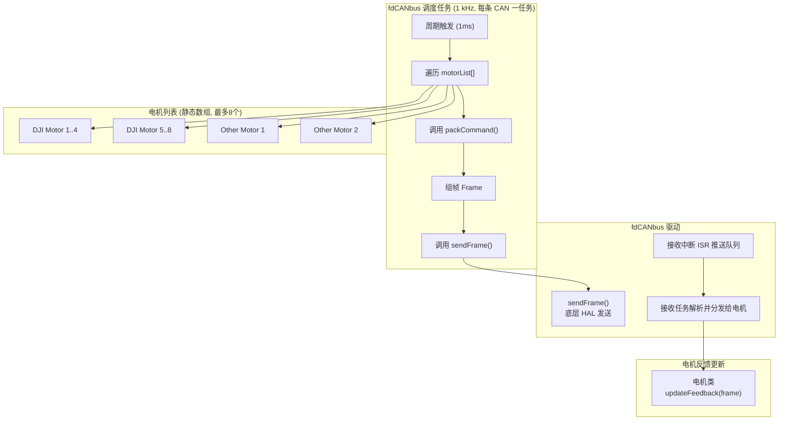
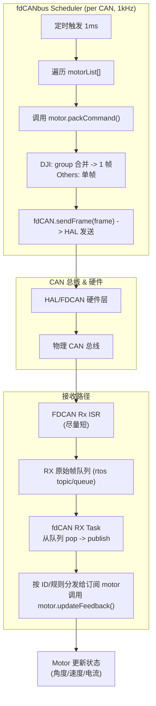

## RC10_R1_FRAME_TEST 说明书

### 编码方式
    统一使用GB2312
### 命名规范
    在类中的变量统一带_的后缀，形参不带后缀

### 文件架构
#### 简介
    此文档重在记录RC10_LIB的设计思路，若是想快速上手RC10_LIB还请移步用户手册
1. BSP_Driver
    此用于存放最底层驱动，如fdCAN, UASRT, SPI IIC, TIM RTOS等驱动。
    前缀为==BSP_==
2. Motor
    此用于存放电机驱动.
    前缀为==Motor==
3. APP
    此用于存放控制器、滤波器和一些工具，又亦或是其他复用性强的算法之类的。
    前缀为==APP==
4. Module
    此用于一些复用性强的模块的封装，如激光测距模块、灯带等等
    此前缀为==Module==

##### 目前的设计思路
用统一的FdCanBus 封装负责fdCAN硬件、过滤与RX分发。用Motor基类定义统一接口，而motor基类可以派生两个主要子类：`DJIMotor`和`ExtendedMotor`。这是由于两种电机的报文发送机制不同。使用FreeRTOS(队列\任务)将CAN的收发与电机控制解耦，使用ID映射或查表方式将接收报文分发到正确的电机对象。
1. fdCanBus设计需求
   作为通信通道，而不是直接服务电机（与RC9的不同点）
   1. 单路CAN能够混搭标准帧和拓展帧
   2. 使用FIFO接收CAN帧，ISR简化，只搬运报文，不解析，解析放到RTOS任务中进行
   3. fdCanBus创建对象后自动生成对应任务
   4. 好处：fdCAN 永远是纯通信层，电机逻辑变化不会污染 CAN 驱动。
   5. ==具体实现==
      1. fdCAN提供发送接口给电机类，提供 sendFrame(const CanFrame&) 接口，电机类不会直接调用 HAL。
      2. fdCAN搬运ISR中的数据包丢到队列，让电机类解析。
      3. 实现CAN发送频率为1kHz，与回传频率一致。内部带一个 1kHz 调度器任务，统一调度挂载的电机。schedulerTask()：1ms 运行一次，遍历挂载电机，收集 packCommand() 的结果，统一 sendFrame()。
         1. 1 ms 到时 → 遍历 motorList[]。
         2. 对每个 motor 调用 motor->packCommand()。
         3. 子类（例如 DJIMotor）在 packCommand() 中，把当前 target 转换成对应协议的报文（或者写进 group 的缓存）。
         4. 如果是 DJI 系列，会把同组的 4 个电机合并成一帧；如果是其他电机，就直接返回一帧。
      4. 成员变量：FDCAN_HandleTypeDef* hfdcan、bus_id、静态数组管理电机指针
      5. 

        


1. FreeRTOS驱动设计
   1. 封成相应的父类，这部分我暂时没想的太多
   2. 任务系统类，提供统一接口来创建和管理任务，绕过CubeMX的配置生成。
      1. 类似ROS节点中的`spin()`,继承任务系统的子类只需要负责`run`或者`loop`
      2. 主要目的是把RTOS的任务抽象为一个功能单元
   3. 通信抽象类，不一定是要用RTOS实现，一些可以用统一的函数实现参数共享。但大体还有有点类似ROS中的pub/sub或者service；
      1. Publisher/Subscriber：一个任务/类可以向某个话题（队列）发布消息，另一个类订阅后在任务中处理。
      2. Service/Client：用于“请求/响应”模式，比如参数配置、一次性命令。
   4. 好处：以后不只是 CAN，还可以接 UART、SPI、传感器等，都能挂在这个 RTOS 通信框架里。
   5. 具体实现
      1. 任务调度（任务类），封装 FreeRTOS TaskHandle_t，统一管理任务创建、启动和运行逻辑。
      2. 通信机制（消息/话题类）抽象一个类似 ROS topic/service 的父类，后续不一定是完全使用FreeRTOS的queue之类的完成通信。
         1. 模仿 ROS 的 pub/sub：
            1. publish(msg)
            2. subscribe(callback)


   
2. 电机封装的实现
   1. 首先有一个Motor_Base抽象类，作为父类，统一电机所需要的通用接口被后续的子类电机重写。
   2. 在Motor_Base后，DJI电机还需一个专属DJI类，因为DJI电机报文的特殊性（一帧CAN发送报文的数据帧包含四个电机电流数据）
   3. 电机发送报文的生成和回收报文的解析在电机类中实现
   4. 具体实现
      1. 提供通用接口(Motor_Base抽象层)：

        setTargetRPM() / setTargetCurrent() / setTargetAngle()/setTargetTotalAngle()

        getRPM() / getPosition() / getCurrent() / getTotalAngle()

        packCommand()（把目标量转成 CAN 报文）

        unpackFeedback()（解析电机返回报文）
      2. DJI_Motor 基类

        所有 DJI 电机共用的打包协议（4 电机合帧）。

        具体型号（M3508、M2006、GM6020）继承这个类，负责具体反馈解析。

      3. ExtMotor 基类

        单电机单帧的控制方式（如 VESC、GO-M8010、达妙）。

        各型号实现自己的 packCommand() & unpackFeedback()。
    


总思维导图(组件/类关系)
```mermaid
flowchart TB
  subgraph RTOS_Wrapper["RTOS 封装"]
    RT_Task["RtosTask\n(任务基类)"]
    RT_Topic["RtosTopic\n(Pub/Sub 抽象)"]
  end

  subgraph fdCANbus_layer["fdCANbus 层 (每路 CAN 一个实例)"]
    fdCAN["fdCANbus\n- hfdcan\n- bus_id\n- motorList[≤8]\n- rxQueue\n- schedulerTask(1kHz)"]
    DJIGroup["DJIMotorGroup\n(批量 4-in-1 打包/拆包)"]
  end

  subgraph Motor_layer["电机层"]
    Motor["Motor (抽象)\n- packCommand()\n- updateFeedback()\n- targets/status\n- 持有 fdCANbus* (组合)"]
    DJIMotor["DJIMotor : Motor\n- 属于某组 (group_id)\n- 协议：4 合 1"]
    OtherMotor["OtherMotor : Motor\n- VESC / Damiao / GO-M8010 Adapter\n- 协议：1 电机 = 1 帧"]
  end

  %% 关系
  RT_Task --- RT_Topic
  fdCAN -->|管理/持有| Motor
  Motor -->|使用 (has-a)| fdCAN
  DJIMotor -->|归属| DJIGroup
  fdCAN -->|可含| DJIGroup

  %% multi-bus hint
  subgraph BUSES["硬件: 三路 FDCAN（bus1..bus3）"]
    bus1["fdCANbus (bus1)"]
    bus2["fdCANbus (bus2)"]
    bus3["fdCANbus (bus3)"]
  end
  bus1 --> fdCAN
  bus2 --> fdCAN
  bus3 --> fdCAN

```

运行时序图

```
                +-----------------------------+
                |        TIMx 定时器          |
                | (1kHz Update Event / IRQ)   |
                +-------------+---------------+
                              |
                              v
                   +---------------------+
                   |  Scheduler Task     |
                   | (阻塞等待信号量)     |
                   +----------+----------+
                              |
                              v
          ------------------------------------------------
          |                      |                       |
  +-------+------+      +--------+-------+      +--------+-------+
  |  DJI Group   |      |  DJI Group    |      |  Other Motor   |
  | (4 Motors)   |      | (4 Motors)    |      | (Single Frame) |
  +--------------+      +----------------      +-----------------+
          |                       |                       |
          v                       v                       v
    +-----------+           +-----------+           +-----------+
    | CAN Frame |           | CAN Frame |           | CAN Frame |
    |  (4x cmd) |           |  (4x cmd) |           | (1x cmd ) |
    +-----+-----+           +-----+-----+           +-----+-----+
          \------------------------|-----------------------/
                                   |
                            +------+------+
                            |   fdCANbus   |
                            | sendFrame()  |
                            +--------------+


```

```

```


#### User层
    用于存放基于RC10_LIB所写的应用层，如机构控制类，Debug类，demo类。
    以及实际所需要创建的任务或启动项。

### 后续开发协作规定
1. 代码中尽量写入多的注释，如果自己懒得写可以使用vscode自带的ai进行补全，笔者的注释也基本是用ai写的。
2. 


